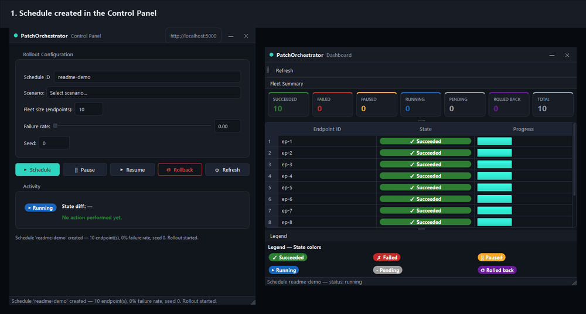
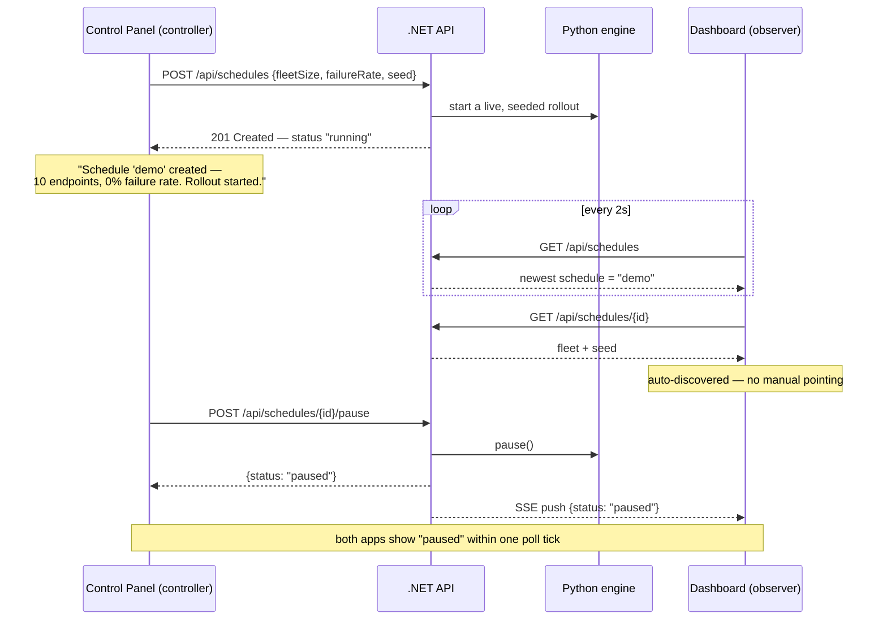
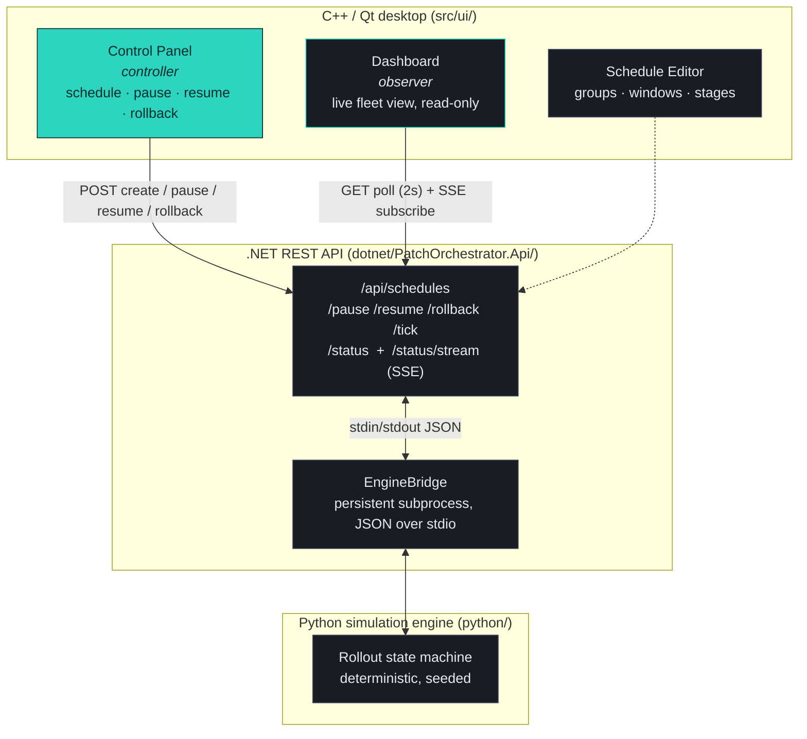
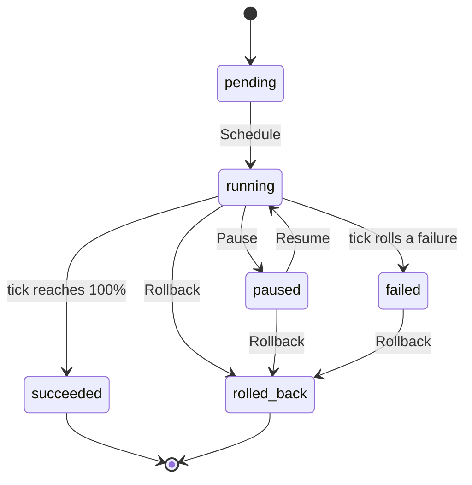

# PatchOrchestrator

[](https://github.com/kutaygunal/PatchOrchestrator/actions/workflows/ci.yml)


A Qt-based **control plane** for scheduling, pausing, and rolling back **fleet-wide software
patches** — a controller and an observer, two separate desktop apps, watching and driving the
same live rollout through a shared .NET REST API and a deterministic Python simulation engine.

PatchOrchestrator is a senior-level C++/Qt engineering showcase. It demonstrates real
cross-layer integration (desktop GUI → HTTP API → simulation engine), careful patching-domain
modeling, and disciplined quality/CI practices. It is built to mirror the kind of work a
**NinjaOne Senior C++ / Qt patching engineer** does every day.



*The Control Panel schedules and drives a rollout; the Dashboard auto-discovers it and mirrors
every state change live — two windows, one shared source of truth.*

---

## Table of contents

- [Overview](#overview)
- [The two apps, one shared brain](#the-two-apps-one-shared-brain)
- [Architecture](#architecture)
- [The rollout state machine](#the-rollout-state-machine)
- [Design system](#design-system)
- [Prerequisites](#prerequisites)
- [Build & run](#build--run)
  - [C++/Qt GUI](#cppqt-gui)
  - [.NET REST API](#net-rest-api)
  - [Python simulation engine](#python-simulation-engine)
  - [End-to-end recipe](#end-to-end-recipe)
- [API reference](#api-reference)
- [Testing](#testing)
- [Packaging & release](#packaging--release)
- [NinjaOne career relevance](#ninjaone-career-relevance)

---

## Overview

**PatchOrchestrator** is a three-layer system that lets an operator plan, supervise, and
recover a software patch rollout across a fleet of endpoints:

- A **C++/Qt desktop GUI** (`src/ui/`) provides the control surface — four apps sharing one
  dark theme and one frameless window chrome:
  - `patchorchestrator_control_ui` — the **controller**: Schedule / Pause / Resume / Rollback
    actions, confirmation dialogs, and a live state badge.
  - `patchorchestrator_ui` — the **observer**: a read-only dashboard listing endpoints and
    their patch status, with a fleet-summary KPI row and a color/icon legend.
  - `patchorchestrator_schedule_ui` — a **schedule-definition** editor for groups, maintenance
    windows, and rollout stages.
  - `patchorchestrator_demo` — a unified hub that hosts all three as tabs, for guided demos.
- A **.NET REST API** (`dotnet/PatchOrchestrator.Api/`) exposes the HTTP boundary for
  schedules, pause/resume/rollback, and status queries (including a live SSE stream), and uses
  an `EngineBridge` to drive the simulation engine.
- A **Python simulation engine** (`python/engine.py` + `python/bridge_persistent.py`) models
  each endpoint's patch state machine deterministically, so the same configuration and seed
  always produce the same rollout.

The **shared source of truth** is the API's schedule store. When the operator clicks
**Schedule** in the control panel, the panel POSTs the configured fleet
(`fleetSize`, `failureRate`, `seed`) to `POST /api/schedules`; the API persists that fleet and
starts a live rollout session. The dashboard reads `GET /api/schedules`, **auto-selects the
most recently created schedule**, and loads that schedule's fleet from the API detail
(`GET /api/schedules/{id}`) — so a job scheduled in the control panel appears in the dashboard
automatically, with no manual pointing and no hardcoded endpoints.

---

## The two apps, one shared brain

The controller and the observer never talk to each other directly — they're two independent
processes that happen to be looking at the same API. That's the whole design: neither app
needs to know the other exists.



A few properties fall out of that design on purpose:

- **The controller can run without the observer**, and vice versa — the API is the only thing
  either one depends on.
- **Any number of observers can watch the same rollout.** Nothing about the dashboard is
  special; it's just a client that polls and subscribes like any other could.
- **State changes are pushed, not just polled.** `GET /api/schedules/{id}/status/stream` is a
  Server-Sent Events endpoint — the moment the controller pauses/resumes/rolls back, every
  connected observer hears about it without waiting for its next poll tick.

---

## Architecture



**How the layers work together**

1. The **Qt GUIs** render a table of simulated endpoints and their patch state, and send
   control actions as plain HTTP requests.
2. The **.NET REST API** is the single source of truth: it persists each schedule's fleet
   config and owns one live `EngineSession` per schedule.
3. The API's **`EngineBridge`** talks to a single long-lived `python bridge_persistent.py`
   subprocess over stdin/stdout JSON, so pause/resume/rollback/tick mutate real, in-memory
   engine state between calls instead of restarting from scratch each time.
4. The **Python engine** advances a deterministic, seeded rollout over the endpoint fleet and
   returns per-endpoint state and progress.
5. The API relays results over HTTP (and pushes them over SSE); every connected **Qt GUI**
   refreshes its table, status bar, and state badges.

Because the engine is deterministic (fixed seed → fixed result), the whole system is easy to
test and reproduce — a key property for a patching control plane.

---

## The rollout state machine

Every endpoint moves through the same six states, driven by the engine
(`python/engine.py`) and mirrored everywhere in the UI — the table badges, the Fleet Summary
tiles, the Legend, and the Control Panel's own action buttons all read from one
`StateBadge::colorForState()` mapping, so a color always means the same thing.



| State | Icon | Color | Meaning |
|---|---|---|---|
| `pending` | `•` | grey | Not started yet. |
| `running` | `▶` | blue | Actively patching. |
| `paused` | `‖` | amber | Frozen mid-rollout — progress does not advance. |
| `succeeded` | `✓` | green | Patch applied successfully. |
| `failed` | `✗` | red | This endpoint's patch attempt failed (per its configured failure rate). |
| `rolled_back` | `↺` | purple | Reverted by an operator action. Succeeded endpoints are left alone. |

---

## Design system

Both desktop apps share one dark theme (`src/ui/theme.{hpp,cpp}`) instead of default Qt
widget styling, so the whole suite reads as one product:

- **Frameless windows** with a shared custom title bar (`src/ui/window_title_bar.hpp`) — brand
  mark, title, minimize/close. Dragging uses `QWindow::startSystemMove()`, so native Aero Snap
  still works on Windows; resizing uses the existing status-bar size grip.
- **One brand accent** (teal, `#2dd4bf`) for primary actions, kept deliberately distinct from
  the six semantic state colors above so "Schedule" never looks like "Succeeded."
- **Icons built from the apps' own visual language**, not generic clip art: the Control Panel
  icon is the same ▶ / ‖ glyphs its own buttons use; the Dashboard icon is a grid of the same
  six state colors its table and legend use.
- **The Legend *is* the badge.** Rather than drawing separate color swatches, the Dashboard's
  legend renders real `StateBadge` widgets — the exact component the table uses — so it can
  never visually drift out of sync with what it's explaining.

---

## Prerequisites

| Component | Requirement |
|-----------|-------------|
| C++/Qt GUI | **Qt 6.8.2** (msvc2022_64), **CMake ≥ 3.16**, a C++17 compiler (MSVC `cl` inside the VS 2022 dev environment, or g++/clang). |
| .NET API | .NET SDK (the project targets `net10.0`; .NET 8/9 SDKs also work to build/run via `dotnet`). |
| Python engine | Python 3.11 with `pytest` (note: on Windows prefer `python`, not the `python3` Store alias). |

Qt discovery is automatic: a plain `cmake -S . -B build` finds Qt under
`C:/Qt/6.8.2/msvc2022_64` (or via `QT_ROOT` / `QT_DIR`). If Qt is not found, the build falls
back to a plain C++ console target for the base executable and skips the Qt Widgets GUIs.

---

## Build & run

### C++/Qt GUI

Configure and build the whole C++/Qt tree:

```bash
cmake -S . -B build -DCMAKE_BUILD_TYPE=Release
cmake --build build --config Release -j
```

With MSVC inside the VS 2022 developer environment:

```
cmd /c "call \"C:\Program Files\Microsoft Visual Studio\2022\Community\VC\Auxiliary\Build\vcvars64.bat\" && cmake -S . -B build && cmake --build build --config Release"
```

This produces the executables under `build/src/Release/`:

- `patchorchestrator.exe` — base Qt console entry point.
- `patchorchestrator_ui.exe` — the observer: read-only dashboard.
- `patchorchestrator_schedule_ui.exe` — schedule-definition editor.
- `patchorchestrator_control_ui.exe` — the controller: Schedule/Pause/Resume/Rollback.
- `patchorchestrator_demo.exe` — all three hosted together as tabs, for guided demos.

Both GUIs expect the .NET API to be running (see below). Each reads its base URL from
`PATCHORCH_API_URL` (default `http://localhost:5000`).

**Control panel** — the **Schedule** action sends the configured fleet to the API:

```bash
export PATH="C:/Qt/6.8.2/msvc2022_64/bin:$PATH"
export PATCHORCH_API_URL="http://localhost:5000"
./build/src/Release/patchorchestrator_control_ui.exe
```

Set **Fleet size**, **Failure rate**, and **Seed**, then click **Schedule**. The panel POSTs
`fleetSize`, `failureRate`, and `seed` to `POST /api/schedules`; the API persists that fleet
as the schedule's source of truth and starts a live rollout. Leaving **Failure rate** at its
default `0.0` guarantees every endpoint succeeds — the fastest way to a clean demo run.

**Dashboard** — read-only; it auto-discovers the latest schedule:

```bash
export PATH="C:/Qt/6.8.2/msvc2022_64/bin:$PATH"
export PATCHORCH_API_URL="http://localhost:5000"
./build/src/Release/patchorchestrator_ui.exe
```

The dashboard calls `GET /api/schedules` and **auto-selects the most recently created
schedule** (newest-first), then renders that schedule's fleet from `GET /api/schedules/{id}`
— no hardcoded endpoints. To override auto-selection, set `PATCHORCH_SCHEDULE_ID`:

```bash
export PATH="C:/Qt/6.8.2/msvc2022_64/bin:$PATH"
export PATCHORCH_API_URL="http://localhost:5000"
export PATCHORCH_SCHEDULE_ID="sch-1"
./build/src/Release/patchorchestrator_ui.exe
```

To run headless (e.g. on a build server or for smoke checks), use Qt's offscreen platform:

```bash
export QT_QPA_PLATFORM=offscreen
./build/src/Release/patchorchestrator_ui.exe
```

### .NET REST API

Build and run the API, pointing the `EngineBridge` at the `python/` directory (independent of
the current working directory):

```bash
dotnet build dotnet/PatchOrchestrator.Api/PatchOrchestrator.Api.csproj -c Release
export PATCHORCH_PYTHON_DIR="<project-root>/python"
ASPNETCORE_URLS=http://localhost:5000 dotnet run \
  --project dotnet/PatchOrchestrator.Api/PatchOrchestrator.Api.csproj \
  -c Release --no-build
```

When it is up, the OpenAPI/Swagger UI is served at `http://localhost:5000/swagger`, the
OpenAPI document at `http://localhost:5000/openapi/v1.json`, and a health check at
`GET http://localhost:5000/api/health`.

### Python simulation engine

The engine is a pure-Python package, importable as `import engine` with `PYTHONPATH` pointing
at `python/`:

```bash
cd python
PYTHONPATH="." python -c "import engine; r = engine.Rollout([engine.Endpoint('ep-1')], seed=42); r.simulate(); print(r.endpoints[0].state, r.endpoints[0].progress)"
```

The persistent JSON bridge (what the API actually drives) is runnable directly too — it reads
one JSON command per line on stdin and writes one JSON response per line to stdout, keeping
one live rollout across calls:

```bash
cd python
PYTHONPATH="." python bridge_persistent.py
# then, on stdin:
{"cmd":"start","endpoints":[{"id":"ep-1","failure_rate":0.1}],"seed":42}
{"cmd":"pause"}
```

### End-to-end recipe

A short copy-paste sequence to confirm the shared schedule behavior — this is exactly the
[sequence diagram above](#the-two-apps-one-shared-brain) played out on your own machine.

1. **Start the API** on `http://localhost:5000` (from the repo root):

   ```bash
   export PATCHORCH_PYTHON_DIR="<project-root>/python"
   ASPNETCORE_URLS=http://localhost:5000 dotnet run \
     --project dotnet/PatchOrchestrator.Api/PatchOrchestrator.Api.csproj \
     -c Release --no-build
   ```

2. **Run the control panel** in a separate terminal, leave **Failure rate** at `0.0`, and
   click **Schedule**:

   ```bash
   export PATH="C:/Qt/6.8.2/msvc2022_64/bin:$PATH"
   export PATCHORCH_API_URL="http://localhost:5000"
   ./build/src/Release/patchorchestrator_control_ui.exe
   ```

3. **Run the dashboard** in another terminal. Do **not** set `PATCHORCH_SCHEDULE_ID`, so it
   auto-selects the newest schedule:

   ```bash
   export PATH="C:/Qt/6.8.2/msvc2022_64/bin:$PATH"
   export PATCHORCH_API_URL="http://localhost:5000"
   ./build/src/Release/patchorchestrator_ui.exe
   ```

4. Confirm the dashboard shows the **same schedule** you scheduled in the control panel, with
   its fleet of endpoints loaded from the API — no restart, no manual id.

5. Click **Pause** in the control panel and watch the dashboard's status bar update within a
   couple of seconds, without touching the dashboard at all. Click **Resume**, then
   **Rollback**, and watch the same thing happen each time.

---

## API reference

| Method | Path | Purpose |
|---|---|---|
| `GET` | `/api/health` | Liveness check. |
| `POST` | `/api/schedules` | Create (or overwrite) a schedule and start its live rollout session. |
| `GET` | `/api/schedules` | List all schedules, newest-first. |
| `GET` | `/api/schedules/{id}` | Detail: persisted fleet, seed, status. |
| `POST` | `/api/schedules/{id}/pause` \| `/resume` \| `/rollback` | Mutate the live `EngineSession` in place. |
| `POST` | `/api/schedules/{id}/tick` | Advance the live session deterministically by N steps. |
| `POST` | `/api/schedules/{id}/simulate` | Stateless one-shot "run to completion" preview, used by the dashboard's table. |
| `GET` | `/api/schedules/{id}/status` | Current derived status. |
| `GET` | `/api/schedules/{id}/status/stream` | Server-Sent Events — live push on every state change. |
| `GET` | `/api/schedules/{id}/actions` | Chronological operator action log. |

---

## Testing

Run each suite **one at a time with a hard timeout** (the project's working rule — never run a
single long-lived or unbounded command).

| Phase | Suite | Command |
|-------|-------|---------|
| P4 | Python engine unit tests | `timeout 180 bash tests/phase4/run_tests.sh` |
| P6 | C++ core unit tests (CTest/gtest) | `timeout 300 bash tests/phase6/run_ctest.sh` (needs the VS 2022 dev env for MSVC `cl`) |
| P5 | .NET REST API contract | `timeout 300 bash tests/phase5/verify_api.sh` |
| P7 | API ↔ engine bridge | `timeout 300 bash tests/phase7/verify_bridge.sh` |
| P11 | End-to-end GUI → API → engine | `timeout 300 bash tests/phase11/verify_integration.sh` |
| P12 | CI/CD config dry-run | `timeout 120 bash tests/phase12/verify_ci.sh` |
| P13 | README verification | `timeout 60 bash tests/phase13/verify_readme.sh` |

Windows (MSVC) variants of the C++-based suites run inside the VS 2022 dev environment:

```
cmd /c "call \"C:\Program Files\Microsoft Visual Studio\2022\Community\VC\Auxiliary\Build\vcvars64.bat\" && bash tests/phase6/run_ctest.sh"
```

CI runs the full matrix on GitHub Actions (`.github/workflows/ci.yml`): it installs Qt
6.8.2 (win64_msvc2022_64), configures with `BUILD_TESTING=ON`, and runs pytest, ctest, and the
Phase 11 end-to-end suite, then uploads the built binaries as an artifact.

---

## Packaging & release

The root `CMakeLists.txt` includes a **CPack** target so the Qt applications can be packaged
into a redistributable installer. The packaging step invokes `windeployqt` (via
`cmake/bundle_qt.cmake`) to bundle the Qt runtime DLLs next to each installed executable
**before** `cpack` packages the tree, so the resulting archive runs on a machine without a
dev Qt install.

Build and package:

```bash
cmake -S . -B build.p14 -DCMAKE_BUILD_TYPE=Release
cmake --build build.p14 --config Release
cpack -B build.p14/package -C Release
```

The installer archive is produced under `build.p14/package/`. See `docs/release-notes.md` for
the release notes (current release: **v0.1.0**).

### Structured logging

All three layers write structured `[ISO-8601 timestamp] LEVEL message` logs for observability
and consistent error handling:

- **C++/Qt GUIs** log API request outcomes and errors via `src/ui/log.hpp`, and stop the
  dashboard's poll timer on window close for graceful shutdown.
- **.NET API** logs every request and the Python bridge call through Microsoft.Extensions
  Logging.
- **Python bridge** logs to stderr (keeping stdout a clean JSON contract) and returns clear
  `{"error": ...}` messages with non-zero exit codes on failure.

---

## NinjaOne career relevance

PatchOrchestrator was designed to demonstrate the skills a **NinjaOne Senior C++ / Qt
patching engineer** relies on:

- **C++/Qt desktop engineering.** Four real Qt Widgets applications (dashboard, schedule
  editor, control panel, demo hub) built with CMake, automoc, and a modern C++17 core, sharing
  one hand-written theme and window-chrome system — not a scaffold.
- **Patching-domain modeling.** The domain model (`src/domain/`) models `Fleet`, `Endpoint`,
  `Group`, `PatchSchedule`, `MaintenanceWindow`, and `RolloutStage` as plain C++ types with
  validation — exactly the kind of careful modeling a patching product needs to reason about
  rollouts safely.
- **Cross-layer integration.** A desktop GUI talking to a .NET REST API that bridges to a
  Python simulation engine — a realistic, layered production architecture where each boundary
  is a clean, tested contract rather than a tangle. Two independent GUIs stay in sync purely
  through that shared API and an SSE stream, with neither aware the other exists.
- **Deterministic simulation.** The engine is seeded and deterministic, so a rollout can be
  reproduced and reasoned about. Predictability is essential for trustworthy patching tooling.
- **Quality and CI discipline.** Every layer has its own test suite (pytest, gtest/CTest,
  API/bridge integration, end-to-end), wired into a GitHub Actions pipeline with artifact
  upload. Hard timeouts and single-command test runners keep the suite reliable.

Taken together, these reflect senior-level software engineering in the patching domain: deep
C++/Qt desktop skills, careful domain modeling, clean cross-layer integration, deterministic
simulation, and the CI/quality practices that keep a fleet-patching product safe to operate.

---

## License

See the project repository for license and contribution details.
